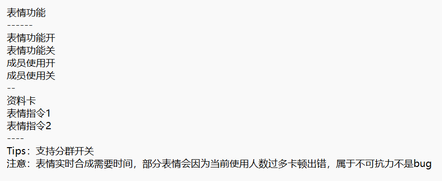

# 红包功能


**由于抢红包操作为敏感操作，频繁使用不可避免的会导致风控，甚至冻结，请谨慎使用或尽量使用小号**


## **功能开关**

强大的自定义开关，想抢哪个抢哪个

.png>).png>)

## **抢包状态**

查看目前抢红包开启的状态和情况，抢到金额等

 (2).png>).png>)

## 抢包回复

模拟真人，可随机回复，延时回复，让人不知道你是秒抢，不会被踢，同时还有未抢到回复，更加真实

.png>).png>)

## 捡漏功能

顾名思义，可以领那些没有被领完的红包

.png>)

## 抢包通知

抢到可以通知自己啦！担心被发现是秒抢的宝宝可以去方便的发送消息感谢了

.png>)

## 发包系统

偷懒利器，一个一个发是不是很不方便？有了它就可以超级方便的发送红包

<mark style="color:red;">**注意：红包阈值和支付密码请私聊自己设置**</mark>

